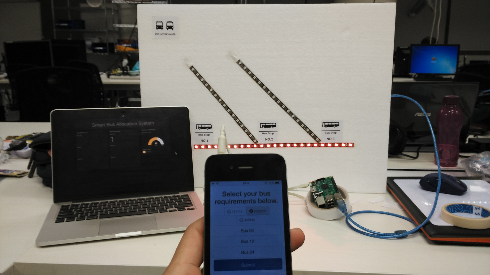

Smart Bus System (SBS)
------

### Background

This is part of a 1D Design project that targets the [LTA Challenge](http://www.lta.gov.sg/innovatorsneeded/), looking at improving the Bus experience for the future of our public transportation system.

### Elevator Pitch

With the rising advancement in Autonomous vehicles and the Internet-of-Things, we aim to transform the public bus transport system in Singapore and creating a more pleasant riding experience. A decentralized bus system allows routes to be served efficiently instead of the current fixed route methodology.

Every bus stop will be equipped with an Access-point that aggregates all the on-demand request from the users and forward it to the Smart Bus System (SBS). An optimized bus route will be generated through SBS and the baseline frequency of the regular bus service will be adjusted over time as the historical data accumulates.

This ensures that spikes in demand on a day to day basis can be handled with new routes be designed through Big-Data Analysis of the bus user's demand. We believe that combining new technologies with our existing public transport infrastructure will be about exciting changes that makes the world we live in a better place.

### Major components

The proof-of-concept demonstrated consists of the following setup:

- Raspberry Pi 3 Access Point
- expressJS server for API and static files
- HTML form for request submission
- client app for bus route algorithm
- Arduino for Neopixel strip control
- Dashboard mockup using Freeboard

15 April 2016  
kennethlimcp :collision:
